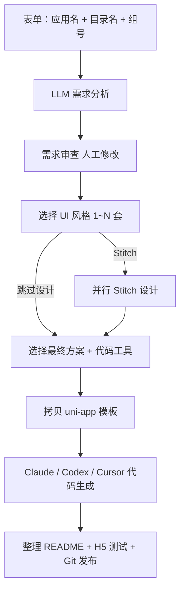

# 工作流架构

## 流程图

## 工作流步骤

| 步骤 | 状态值 | 说明 |
|------|--------|------|
| 1 | INPUT / ANALYZE | 用户输入；LLM 生成 4 页方案 |
| 2 | REVIEW_REQUIREMENT | 用户审查并修改需求 |
| 3 | SELECT_STYLES | 选择风格；Stitch 或跳过设计 |
| 4 | DESIGN | Stitch MCP 并行设计（可跳过） |
| 5 | SELECT_PLAN | 选择方案 + 代码生成工具 |
| 6 | INIT_PROJECT / CODEGEN | 初始化 + CLI 生成 |
| 7 | EVALUATE | 整理 / 测试 / 发布 |
| 8 | DONE | 工作流完成 |

## 模块

| 模块 | 路径 | 说明 |
|------|------|------|
| Web API | `app/main.py` | FastAPI 路由、SSE、后台任务 |
| 编排器 | `app/workflow/orchestrator.py` | 状态机、提示词、CLI |
| LLM | `app/llm/client.py` | OpenAI 兼容多模型 |
| Stitch | `app/stitch/mcp_client.py` | HTTP JSON-RPC MCP |
| H5 测试 | `app/hbuilderx/runner.py` | HBuilderX / uniapp-cli |
| 发布 | `app/publish/git_publish.py` | Git worktree 发布 |
| IDE | `app/ide/cursor.py` | Cursor 打开项目 |
| 取消 | `app/workflow/cancel.py` | 中断 + 杀子进程 |
| 前端 | `app/web/` | 8 步向导 + 侧栏 |

## 状态

会话状态持久化于 `.runtime/sessions/<session_id>/state.json`，支持刷新页面后继续。

侧栏列表按 `created_at` 倒序；删除会话会终止 CLI / H5 等关联进程。

## Stitch MCP 规范

详见 [STITCH_MCP_SPEC.md](./STITCH_MCP_SPEC.md)

- **项目命名**：`{应用名}+{中文风格名}`
- **设计流程**：每风格一次请求生成 page1～page4
- **产物**：确认方案时下载至 `static/stitch/tab*.{png,html}`

## 规划

- **Open Design** 集成为可选本地设计引擎（待办，见 `docs/优化分析.md`）
