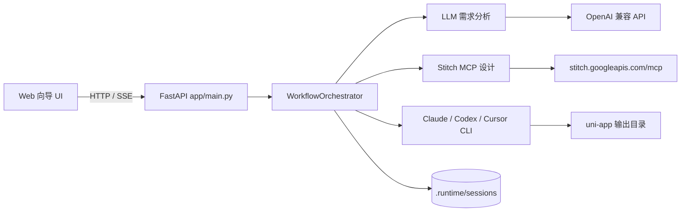
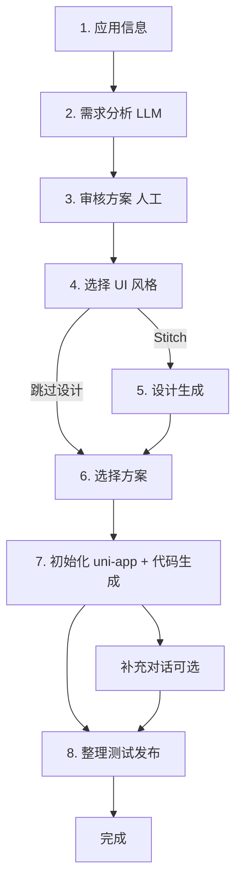

# App 生成工作流说明

本文档说明 `workflow_uniapp` 的项目目标、架构、端到端流程、外部工具与运行环境，供开发与使用对照。

---

## 1. 项目概述

本项目将原先基于 n8n 的「应用生成」流水线落地为本地 Web 工作流：输入应用名称后，依次完成需求分析、人工审核、UI 风格选择、Stitch 设计生成（可跳过）、方案确认、uni-app 工程初始化、AI 代码生成，以及 **整理 / H5 测试 / Git 发布**。

**主路径**：Python（FastAPI）+ 本地文件持久化，默认端口 **8765**。  
**可选路径**：`backend-java/`（Spring Boot + MySQL），默认端口 **8766**，与 Python 会话数据不互通。

核心价值：

- 8 步向导 + 侧栏多项目管理（组号筛选、创建时间、删除并终止进程）
- 步骤可视化、可手动切换查看；设计 / 代码生成可暂停
- 设计路线：Stitch MCP 或 **跳过设计**（直接进入选方案）
- 代码生成工具在第 **6** 步选择：Claude Code（默认）/ Codex / Cursor Agent
- 第 8 步：README 功能清单、HBuilderX 独立端口 H5 测试、Git 发布、用 Cursor 打开项目
- 代码生成后支持右侧补充对话继续改需求 / 修 Bug

---

## 2. 项目架构

### 2.1 总体结构

```text
workflow_uniapp/
├── app/                      # Python 主后端
│   ├── main.py               # FastAPI 路由、SSE、后台任务
│   ├── config.py             # 加载 local_config.yaml / config.yaml
│   ├── models.py             # 工作流状态与步骤枚举
│   ├── llm/client.py         # OpenAI 兼容 LLM（需求分析）
│   ├── stitch/mcp_client.py  # Google Stitch MCP（HTTP JSON-RPC）
│   ├── hbuilderx/runner.py   # 第 8 步 H5 编译测试
│   ├── publish/git_publish.py# Git 分支发布
│   ├── ide/cursor.py         # 用 Cursor 打开项目目录
│   ├── workflow/
│   │   ├── orchestrator.py   # 步骤编排、CLI 调用、提示词
│   │   ├── state.py          # 会话落盘 / 列表
│   │   ├── cancel.py         # 设计/代码生成取消
│   │   └── quality.py        # 反馈等辅助
│   └── web/                  # 前端向导（HTML/JS/CSS）
├── backend-java/             # 可选 Java 后端
├── .harness/                 # Agent 规范、wiki、变更记录
├── .runtime/sessions/        # 会话状态 JSON（Python 主路径）
├── local_config.yaml         # ★ 本地密钥与接口（直接改这里）
├── local_config.example.yaml # 配置模板
├── config.yaml               # UI 风格等静态配置（无密钥）
├── run.py / cli.py           # Web / 命令行入口
├── setup.sh / start.sh       # 安装 / 启停
├── docs/工作流说明.md         # 本文档
└── README.md                 # 快速开始
```

### 2.2 架构示意



### 2.3 模块职责

| 模块 | 路径 | 职责 |
|------|------|------|
| Web API | `app/main.py` | 会话 CRUD、步骤触发、SSE 进度、取消任务 |
| 编排器 | `app/workflow/orchestrator.py` | 状态机、提示词、模板拷贝、流式 CLI 日志 |
| 状态存储 | `app/workflow/state.py` | `state.json` 读写与会话列表 |
| 取消 | `app/workflow/cancel.py` | 协作式中断循环 + 杀掉子进程 |
| LLM | `app/llm/client.py` | 生成 4 页需求 JSON |
| Stitch | `app/stitch/mcp_client.py` | `create_project` / `generate_screen_from_text` 等；`invalid argument` 有限重试 |
| H5 测试 | `app/hbuilderx/runner.py` | uniapp-cli 编译；每会话独立端口（8100–8999） |
| 发布 | `app/publish/git_publish.py` | worktree + 拷贝 + push |
| IDE | `app/ide/cursor.py` | `cursor -n` 打开项目 |
| 前端 | `app/web/` | 8 步向导、侧栏项目列表、补充对话 |

### 2.4 数据持久化

**Python 主路径不使用 MySQL**，数据落在本地文件：

| 数据 | 位置 |
|------|------|
| 会话状态（步骤、需求、风格任务、日志、工具选择等） | `.runtime/sessions/<session_id>/state.json` |
| 反馈累计 | `.runtime/feedback.json` |
| 服务日志 | `.runtime/logs/python.log` |

可选 **Java 后端** 使用 MySQL 库 `workflow_uniapp`，表结构见 `backend-java/src/main/resources/schema.sql`。

---

## 3. 工作流程

### 3.1 步骤一览（前端 8 步）

| # | UI 步骤 | 内部 `WorkflowStep` | 说明 |
|---|---------|---------------------|------|
| 1 | 应用信息 | `input` → `analyze` | 输入应用名、目录名、分析模型，发起分析 |
| 2 | 需求分析 | `analyze` | LLM 生成 4 页方案（自动） |
| 3 | 审核方案 | `review_requirement` | **可人工编辑**后保存并确认 |
| 4 | UI 风格 | `select_styles` | 勾选 1～N 套风格与配色；**Stitch 设计** 或 **跳过设计**（直达第 6 步） |
| 5 | 设计生成 | `design` | 多套风格并行 Stitch（并发上限 3）；进度可「前往查看」；可暂停 |
| 6 | 选择方案 | `select_plan` | 选定风格方案 + **代码生成工具** + 框架；卡片可「去查看」Stitch 项目 |
| 7 | 代码生成 | `init_project` → `codegen` | 拷贝模板并 CLI 生成；可暂停；支持补充对话 |
| 8 | 整理测试发布 | `evaluate` → `done` | 生成 README + HBuilderX 运行到 Chrome |

失败时 `step=error`，并带 `error_step` 便于回到对应环节重试。

### 3.2 流程总图



### 3.3 各环节要点

**需求分析**  
- 由 OpenAI 兼容接口根据应用名产出三套 `RequirementPlan`（方向 + 摘要 + page1～page4）。  
- 模型可在启动表单中选择（见 `config.yaml` / `local_config.yaml` 的 `llm.models`）。  
- 需求设计遵循 harness skill **`pm-brainstorm`**（Frame→Diverge→Converge；JTBD/HMW）；精简指令见 `.harness/skills/pm-brainstorm/requirement-prompt.md`，由 `app/llm/client.py` 注入 system prompt。

**审核方案**  
- 分析结果给出 **三套不同功能方向**，卡片点选切换。  
- 可改应用名、方向名、产品定位、页面标题/功能点/说明。  
- 可带补充提示词 **重试分析**（按头脑风暴节奏重新发散，而非微调旧案）。  
- 提示词禁止拍照/相册、录音、社交分享等能力。  
- `PUT /api/session/{id}/requirement` 保存；`POST .../requirement/select` 切换；`POST .../confirm-requirement` 进入风格选择。  
- 等待用户操作时会关闭 SSE，避免表单被重绘冲掉。

**UI 风格**  
- 风格列表来自 `config.yaml`（展示名为中文）。  
- 设计路线：**Stitch MCP 设计**（默认）或 **跳过设计，直接代码生成**（提交后进入第 6 步，不经过第 5 步）。  
- 代码生成工具在 **第 6 步「选择方案」** 选择，第 4 步不再展示工具选项。

**设计生成（Stitch）**  
- 多套已选风格**并行**创建独立 Stitch 项目（并发上限 3）。  
- **项目命名**：`{产品名称}+{中文风格名}`（例如 `藏品库+亚历山大`）。  
- 每项目一次请求生成 page1～page4 共 4 屏。  
- 进度条可点「前往查看」打开 `https://stitch.withgoogle.com/projects/{project_id}`。  
- 「暂停」可终止当前设计任务。

**选择方案**  
- 仅状态为 `done` 的风格方案可选。  
- 确认框架（当前 uni-app / Vue）与代码生成工具。  
- 卡片右侧 **「去查看」** 打开 `https://stitch.withgoogle.com/projects/{project_id}`（跳过设计的无 Stitch 项目无链接）。  
- 确认时通过 Stitch `get_screen` 下载 4 屏的设计图与 HTML 为 `tab1.png`/`tab1.html`～`tab4.png`/`tab4.html`（先落会话目录，初始化项目后拷贝到 `{项目}/static/stitch/`）。

**代码生成**  
- 从 `UNIAPP_TEMPLATE_DIR` 拷贝到 `UNIAPP_OUTPUT_DIR/<project_dir>`。  
- **两套提示词**（`build_codegen_prompt_with_stitch` / `build_codegen_prompt_skip_design`）：有 Stitch 稿时按 `static/stitch/tab*.png`+`tab*.html` 复现；跳过设计时按需求与风格自行设计实现。公共要求含：登录/注册/引导/「我的」只改文案与主题、自测可编译通过且功能闭环。  
- 按所选工具流式调用 CLI，日志实时推到前端。  
- 「暂停」可终止 CLI 子进程。  
- 右侧「补充对话」可在项目已初始化后继续发指令改代码。

**整理测试发布**  
- **整理**：根据需求方案生成详细功能清单，写入项目 `README.md`；右侧 **「用 Cursor 打开」** 在新窗口打开项目目录。  
- **测试**：每次测试前清空该项目 H5 编译产物；通过 HBuilderX 工具链编译并打开 Chrome；**不同会话使用独立端口（8100–8999）**；可 **关闭测试端口**。  
- **发布**：指定 Git 仓库路径与分支名（默认 `组号/产品目录`）；拉取最新后若分支已存在则提示改名，否则新建分支、拷贝项目并推送远程。三项完成后可结束工作流。

---

## 4. 工具介绍

### 4.1 LLM（需求分析）

| 项 | 说明 |
|----|------|
| 协议 | OpenAI Compatible Chat Completions |
| 配置 | `LLM_BASE_URL` / `LLM_API_KEY` / `LLM_MODEL` |
| 用途 | 生成 4 页产品功能方案 |
| 实现 | `app/llm/client.py` |

### 4.2 Google Stitch MCP（UI 设计）

| 项 | 说明 |
|----|------|
| 端点 | 默认 `https://stitch.googleapis.com/mcp` |
| 认证 | 推荐仅使用 `STITCH_API_KEY`（`X-Goog-Api-Key`） |
| 主要调用 | `create_project`、`generate_screen_from_text`、`get_screen` |
| 实现 | `app/stitch/mcp_client.py` |

注意：勿将 API Key 与 OAuth Bearer 混用。本机 gcloud ADC 若未设置 quota project，走 OAuth 易 403；当前客户端默认走 API Key。

文档参考：[Stitch MCP Setup](https://stitch.withgoogle.com/docs/mcp/setup)  
仓库内规范：`.harness/wiki/STITCH_MCP_SPEC.md`

### 4.3 代码生成 CLI（三选一）

| 工具 | 环境变量 | 默认场景 |
|------|----------|----------|
| **Claude Code** | `CLAUDE_BIN` / `CLAUDE_MODEL` | 默认；stream-json 实时进度 |
| **Codex** | `CODEX_BIN` / `CODEX_MODEL` / `CODEX_SANDBOX` | 结构化生成 |
| **Cursor Agent** | `CURSOR_BIN` / `CURSOR_MODEL` | IDE 集成体验 |

调用封装在 `orchestrator` 的 `stream_command_to_logs` / `execute_codegen_tool` 中，输出写入会话日志供 SSE / 轮询展示。

### 4.4 uni-app 模板

| 变量 | 含义 |
|------|------|
| `UNIAPP_TEMPLATE_DIR` | 模板工程路径（如 `uniapp_base`） |
| `UNIAPP_OUTPUT_DIR` | 生成项目输出根目录 |

初始化步骤会把模板拷贝到 `{UNIAPP_OUTPUT_DIR}/{project_dir}`。

### 4.5 可选 Java 后端

- 端口 **8766**，可接 MySQL。  
- 启动：`./start.sh java` 或 `./start.sh all`。  
- 适合需要库表查询/运维的场景；与 Python 会话数据不互通。

---

## 5. 环境说明

### 5.1 运行环境要求

| 依赖 | 说明 |
|------|------|
| Python 3.9+ | 主后端（推荐 3.10+） |
| Node / 各 CLI | 按所选代码生成工具安装 `claude` / `codex` / `agent` |
| 网络 | 访问 LLM Base URL、Stitch MCP |
| （可选）Java 17+ / Maven / MySQL | 仅 Java 后端需要 |

### 5.2 安装与启动

```bash
# 首次
./setup.sh
# 编辑 local_config.yaml：至少填写 llm.api_key、stitch.api_key，并确认模板/输出路径

# 启动 Python（推荐）
./start.sh python

# 或
source .venv/bin/activate && python run.py
```

### 5.3 访问地址

默认 `HOST=0.0.0.0`、`PORT=8765`：

| 方式 | 地址 |
|------|------|
| 本机 | http://127.0.0.1:8765 |
| 局域网 | http://\<本机局域网 IP\>:8765 |

仅本机访问时可将 `local_config.yaml` 中 `server.host` 改为 `127.0.0.1`。

健康检查：

```bash
curl http://127.0.0.1:8765/api/health
```

### 5.4 主要配置（local_config.yaml）

复制模板后编辑根目录 **`local_config.yaml`**（已加入 `.gitignore`）：

```bash
cp local_config.example.yaml local_config.yaml
```

| 配置项 | 说明 |
|--------|------|
| `llm.base_url` | OpenAI 兼容地址，当前默认 `https://api.ali.cdn.pianke.xyz/v1` |
| `llm.api_key` | LLM API Key |
| `llm.model` / `llm.models` | 默认模型与下拉列表 |
| `stitch.api_key` | Google Stitch API Key |
| `stitch.mcp_url` | Stitch MCP 地址 |
| `uniapp.template_dir` / `output_dir` | 模板与输出目录 |
| `codegen.*` | Claude / Codex / Cursor CLI |
| `hbuilderx.*` | HBuilderX 应用路径与 CLI（第 8 步测试） |
| `publish.*` | 默认发布仓库与 base 分支 |
| `server.host` / `port` | Web 监听 |

兼容：无 `local_config.yaml` 时可继续用 `.env`（见 `.env.example`）；**两者都有时以 `local_config.yaml` 为准**。

静态业务配置（风格列表等）仍在 `config.yaml`。

### 5.5 常用运维命令

```bash
./start.sh python          # 启动 / 重启 Python
./start.sh status          # 查看端口与健康状态
./start.sh stop            # 停止（若脚本支持）
python cli.py status <session_id>
ls .runtime/sessions/
```

恢复某次会话（浏览器）：

```text
http://127.0.0.1:8765/?session=<session_id>
```

或通过左侧项目列表切换。

---

## 6. API 速览（Python）

| 方法 | 路径 | 说明 |
|------|------|------|
| GET | `/` | 向导首页 |
| GET | `/api/health` | 健康检查 |
| GET | `/api/config` | 前端配置（风格、模型等） |
| GET | `/api/sessions` | 会话列表 |
| POST | `/api/session/start` | 开始分析 |
| PUT | `/api/session/{id}/requirement` | 保存需求修改 |
| POST | `/api/session/{id}/confirm-requirement` | 确认需求 |
| POST | `/api/session/{id}/styles` | 提交风格选择 |
| POST | `/api/session/{id}/design` | 启动 Stitch 设计 |
| POST | `/api/session/{id}/skip-design` | 跳过设计 |
| POST | `/api/session/{id}/select-plan` | 确认方案并准备生成 |
| POST | `/api/session/{id}/generate-code` | 启动代码生成 |
| POST | `/api/session/{id}/followup` | 补充对话 |
| POST | `/api/session/{id}/cancel` | 暂停/终止进行中的设计或代码生成 |
| GET | `/api/session/{id}/events` | SSE 进度 |
| POST | `/api/session/{id}/analyze` | 重试需求分析 |
| POST | `/api/session/{id}/evaluate` | 进入整理测试发布 |
| POST | `/api/session/{id}/prepare-readme` | 生成 README 功能清单 |
| POST | `/api/session/{id}/open-in-cursor` | 用 Cursor 新窗口打开项目 |
| POST | `/api/session/{id}/run-h5-test` | HBuilderX 运行到 Chrome |
| POST | `/api/session/{id}/stop-h5-test` | 关闭 H5 测试进程与端口 |
| GET | `/api/session/{id}/publish-defaults` | 发布默认仓库路径与分支名 |
| POST | `/api/session/{id}/publish` | 新建分支并推送远程 |
| POST | `/api/session/{id}/complete-workflow` | 整理+测试+发布完成后结束 |
| POST | `/api/session/{id}/feedback` | 兼容旧反馈接口 |
| DELETE | `/api/session/{id}` | 删除会话（并终止相关进程） |

---

## 7. 使用注意

1. **密钥**：勿把真实 `.env` 提交到仓库；参考 `.env.example`。  
2. **Stitch 认证**：优先 API Key；避免 API Key + Bearer 混用。  
3. **长任务**：设计 / 代码生成耗时长，可用页面内「暂停」；暂停后当前网络请求可能仍会跑完一次再停。  
4. **会话隔离**：侧栏切换项目即切换 `session_id`；状态相互独立。  
5. **模板路径**：务必指向可用的 uni-app 基座，否则初始化失败。  
6. **防火墙**：局域网访问需本机防火墙放行 Python / 8765 端口。

---

## 8. 相关文档

| 文档 | 内容 |
|------|------|
| [README.md](../README.md) | 快速开始 |
| [优化分析.md](./优化分析.md) | 性能与功能优化建议 |
| [.harness/wiki/ARCHITECTURE.md](../.harness/wiki/ARCHITECTURE.md) | 架构备忘 |
| [.harness/wiki/STITCH_MCP_SPEC.md](../.harness/wiki/STITCH_MCP_SPEC.md) | Stitch 提示词与命名约定 |
| [.harness/skills/app-gen-workflow/SKILL.md](../.harness/skills/app-gen-workflow/SKILL.md) | Agent 技能摘要 |
| [.harness/audit/](../.harness/audit/) | 审计与优化清单 |

---

*文档对应仓库主路径：Python FastAPI 工作流。若行为与本文不一致，以代码与 `.env` / `config.yaml` 实际配置为准。*
